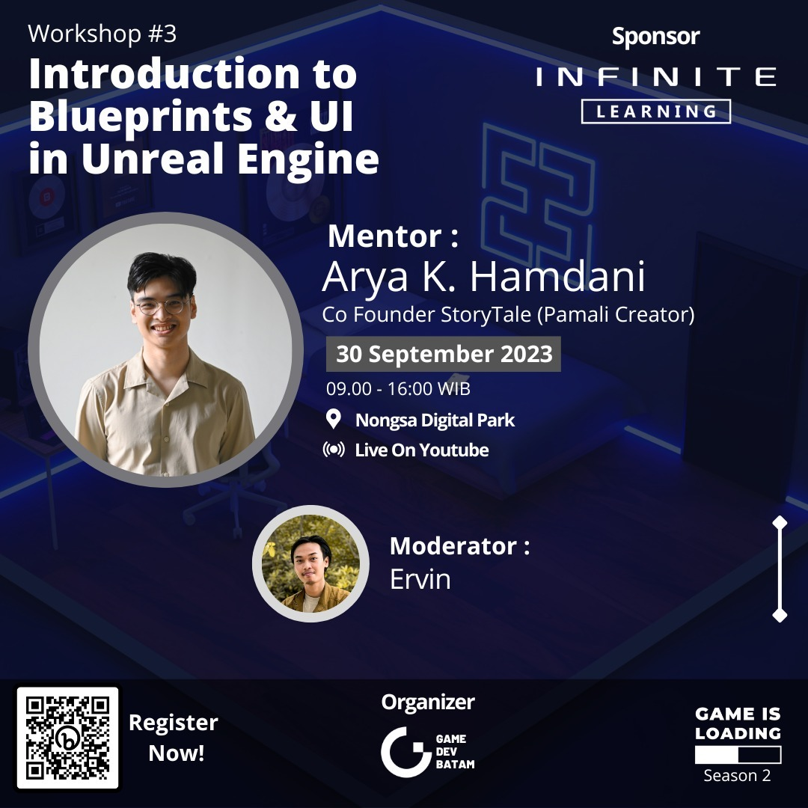

# Unreal Engine 4 Workshop: Introduction to Blueprints and User Interface

Welcome to the Unreal Engine 4 Introduction to Blueprints and User Interface workshop template! This repository serves as a starting point for your workshop materials and project files.

## Table of Contents
- [Overview](#overview)
- [Workshop Prerequisites](#workshop-prerequisites)
- [Getting Started](#getting-started)
- [Workshop Agenda](#workshop-agenda)
- [Project Structure](#project-structure)
- [Contributing](#contributing)
- [License](#license)

## Overview
In this workshop, participants will learn the basics of Unreal Engine 4, focusing on Blueprints and User Interface design. This project provides a simplified game template where students can apply what they learn during the workshop.

## Workshop Prerequisites
Before attending the workshop, participants should have:

- Basic knowledge of game development concepts.
- Unreal Engine 4 installed on their machine. Recommended version is `4.27.2`. Download it from [Epic Games](https://www.unrealengine.com/en-US/).
- A code editor like Visual Studio or Visual Studio Code installed for scripting (optional but recommended).

## Getting Started
1. Clone or download this repository to your local machine.
2. Open the project in Unreal Engine 4.
3. Follow along with the workshop materials provided in the `workshop_materials` folder.

## Workshop Agenda
This workshop covers the following topics:

- Introduction to Unreal Engine 4.
- Blueprint fundamentals and creating gameplay logic.
- Creating and designing user interfaces (UI).
- Integrating UI elements into the game.
- Testing and iterating on your project.

## Project Structure
The project structure is designed to facilitate learning and collaboration:

- **`Template/`**: Contains assets from Unreal Engine's First Person template project.
- **`Assets/`**: Contains assets used in the project (textures, meshes, audio, etc.).
- **`Blueprints/`**: Houses the Blueprint scripts for gameplay mechanics.
- **`UI/`**: Contains UI assets and UMG (Unreal Motion Graphics) UI widgets.
- **`Maps/`**: Stores level maps for the project.
- **`Workshop_Materials/`**: Contains workshop presentation slides, exercise files, and additional resources.

## Third Party Assets Used

(SuperGrid Starter Pack)[https://www.unrealengine.com/marketplace/en-US/product/supergrid-starter-pack]

## License
This project is licensed under the MIT License - see the [LICENSE](LICENSE) file for details.

---

Happy learning and teaching Unreal Engine 4! If you have any questions or feedback, please don't hesitate to reach out.
